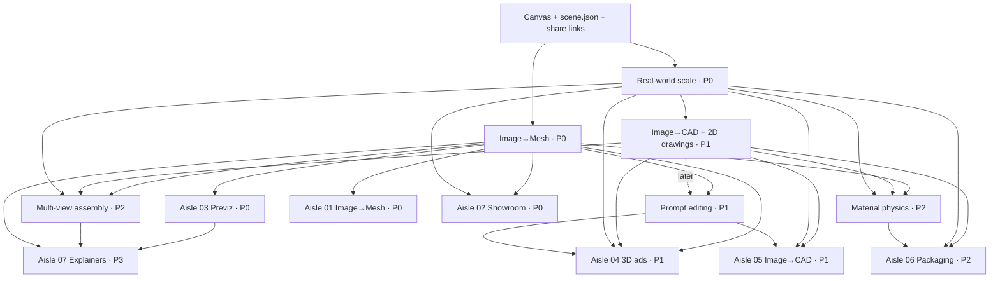

# Annie 3D vision: the 3D supermarket

Status: founder decision record, 2026-09-26. **Supersedes the positioning in
`MVP_STRATEGY.md` §1–2** ("3D advertising workspace"). 3D ads are now one aisle of a larger
store. `MVP_VERTICAL_WORKFLOWS.md` still holds the node detail for the 3D ads aisle.

Read this first if you are an agent joining the project. It says what we are building, in
what order, and what already exists. It does not change any code by itself.

## 1. The vision in one paragraph

Most people think 3D is for games and movies. Annie 3D is a **supermarket of ready-made 3D
workflows** for everything else: measuring a real object from photos, turning a photo into
editable CAD, planning a camera move before paying for AI video, designing packaging,
showing a product on a store screen, explaining a hard concept. Shoppers bring a few photos,
a prompt or a sketch, pick a workflow off the shelf, and take home something usable. The
shelves hold **imported goods** (other companies' 3D models and APIs) and **our own brand**
(engines we build), the way Coles sells other brands next to its own label.

Slogans in use (English, keep the wording):

- "Take a walk down the aisles. The 3D that makes your life easier might already be on the shelf."
- "3D for everything else." (Games and movies were only the first aisle.)

## 2. Principles

1. **Only 3D.** We never generate final video, images or voices. Higgsfield, ElevenLabs,
   Seedance, Kling, Veo and similar tools receive our outputs; we do not compete with them.
2. **Everything is a workflow on the node canvas.** Every engine and every aisle is built
   from nodes wired on the canvas. The canvas is the core interface, not a side feature.
3. **Users can build their own aisles.** They rewire nodes into new workflows, add their own
   nodes through the engine protocol, and every node runs on an AI harness specialised for 3D
   (it reasons about scenes, sizes, cameras and parts, not just text).
4. **Imported goods fill the shelves; own-brand goods are the reason to shop here.** Imported
   calls carry a thin margin. Own-brand engines carry the margin and the moat.
5. **Open what is ready, research the rest.** P0 must run only on what exists today.
6. **Honest status.** Never describe a simulated engine, a preview or a research result as a
   shipped capability.

## 3. Engines (shared features used by many aisles)

| Engine | What it does | Source | Priority | Status (2026-09-26) |
| --- | --- | --- | --- | --- |
| Workflow canvas + `scene.json` + share links | Base layer; the engine registry is where suppliers plug in | Own | Base | Live |
| Image→Mesh | Textured mesh (GLB) of complex, organic, detailed objects | Imported: Meshy, Tripo, Pixal3D (Hunyuan possible) | P0 | Canvas node exists; supplier APIs being wired |
| Real-world scale | True size in metres from four photos: structure-from-motion camera poses, then gradient descent fits the metric scale | Own | P0 | Working code held by the founder; not yet a service. Get the code and its provenance from the founder before wiring |
| Prompt editing | Point, paint or lasso a region, then describe the change; only the selection changes; each edit is a new version | Own | P1 | Region-select UI live in the 3D editor; edit engine not wired |
| Image→CAD + 2D drawings | Editable parametric CAD of man-made objects from photos, plus dimensioned 2D sketches | Own | P1 | In research (main repo image-to-CAD pipeline) |
| Multi-view assembly | Places parts and objects where they belong (a phone's parts inside its frame, props where a prompt asks), using spatial perception from many cameras | Own | P2 | Not started; highest-risk research |
| Material physics | Crumple, crush, stretch until it tears; toughness and gloss per material | Own | P2 | Not started; built first for packaging |

Image→Mesh vs Image→CAD: use Mesh for organic, textured things (a dog, a plush toy, food, a
statue). Use CAD for man-made objects that must measure right (a bottle, a bracket, a phone
case, furniture). Ads and Showroom use whichever fits the product.

Image→Mesh and Image→CAD are both an engine and an aisle of their own.

## 4. Aisles (niches) of version 1

| Aisle | Who buys | Priority | Kind |
| --- | --- | --- | --- |
| 01 Image→Mesh | Creators, game makers, 3D printing | P0 | Aisle + engine |
| 02 Showroom | Tech stores, cosmetics counters, trade fairs | P0 | Sub-branch of Mesh/CAD |
| 03 Previz | AI filmmakers, agencies, storyboard artists | P0 | Aisle; uses Mesh for quick props |
| 04 3D ads | E-commerce brands: home goods, then tech, then jewelry | P1 | Sub-branch of Mesh/CAD |
| 05 Image→CAD | Engineers, makers, small factories | P1 | Aisle + engine |
| 06 Packaging | Packaging plants and brand teams | P2 | Separate aisle |
| 07 Concept explainers | Teachers, trainers, technical sales | P3 | Separate aisle, low priority |
| Architecture | — | Future | Out of version 1 scope |

### 01 Image→Mesh (P0)
Photo or prompt in, GLB out, made by the best imported model for the job. Needs: Image→Mesh
engine; prompt editing later. Traffic aisle with thin margin.

### 02 Showroom (P0)
A product on a store screen that shoppers steer from their phone: scan a QR code, tilt the
phone, the product follows; snapshots go back to the phone. Needs: Image→Mesh, real-world
scale; Image→CAD later for exact products. Built as the `simulation` node (showroom
environment, phone remote over the `SimRoom` Durable Object); runs on placeholder models
until supplier engines are wired. Earliest business revenue.

### 03 Previz (P0)
Block out a scene with rough shapes (a person is a cylinder), move them across the floor,
draw the camera path, and export a **handoff pack** any AI video tool or LLM can use. We do
not generate video. Needs: Image→Mesh for quick props; multi-view assembly later for
layouts from a prompt. Status: not started; handoff formats researched (section 8).
Competitor: Higgsfield 3D Jutsu does blocking-to-video but pushes to Higgsfield's own
video; our angle is a neutral pack for every platform.

### 04 3D ads (P1)
Hero renders, packshots from any angle, ad videos in 1:1, 4:5 and 9:16, all from one
accurate model. Order of verticals: **home goods** (rigid, simple, easiest to get exactly
right) → **tech** (hero shots first; exploded "parts flying apart" views need multi-view
assembly) → **jewelry** (hardest to render: gems and metal; rings suit CAD). Needs: Mesh or
CAD, scale, prompt editing; assembly for exploded views. The ad workflow exists on the
canvas (photo → 3D model → stage → packshot → ad video → export); engines are simulated.

### 05 Image→CAD (P1)
A parametric model the user can adjust, plus dimensioned 2D sketches. Needs: real-world
scale; prompt editing on CAD. Before quoting any benchmark, recover it from the original
run logs and state the test object.

### 06 Packaging (P2)
Kept separate because the difference is **materials and physics**, not shape. Phase 1:
rigid boxes, bottles and cans with die-lines and label mockups (needs only CAD + scale).
Phase 2: flexible pouches (a snack bag must crumple, crush, stretch until it tears, with
toughness and gloss per material). Key link: **Image→CAD's 2D drawing is the die-line**
that packaging plants need. Tearing and crumpling are offline simulation, not real-time web.

### 07 Concept explainers (P3)
Step-by-step 3D scenes people rotate, label and share by link (for example the four strokes
of an engine). Same technology as previz, different market, so a separate aisle. Needs: the
previz engine, multi-view assembly, Image→Mesh. Note: Gemini, ChatGPT and Claude already
make free, one-off interactive 3D answers; our angle is scenes people build, edit and share.

## 5. Dependency graph

A layer needs the layers above it.

What each aisle needs (Needs = required at launch; Either = Mesh or CAD, whichever fits the
product; Later = an upgrade after launch):

| Aisle | When | Mesh | Scale | CAD | Prompt edit | Assembly | Physics |
| --- | --- | --- | --- | --- | --- | --- | --- |
| Image→Mesh | P0 | Needs | — | — | Later | — | — |
| Showroom | P0 | Needs | Needs | Later | — | — | — |
| Previz | P0 | Needs | — | — | Later | Later | — |
| 3D ads | P1 | Either | Needs | Either | Needs | Later (exploded views) | — |
| Image→CAD | P1 | — | Needs | Needs | Needs | — | — |
| Packaging | P2 | Later | Needs | Needs | — | — | Needs |
| Concept explainers | P3 | Needs | — | — | — | Needs | — |

Explainers also reuse the previz engine. Critical path: Image→CAD and multi-view assembly
gate five of the seven aisles' full versions. Scale and CAD are the most reused engines.

## 6. Build order

| Phase | Engines | Aisles |
| --- | --- | --- |
| P0 now | Image→Mesh (supplier APIs), real-world scale | Image→Mesh, Showroom, Previz (Seedance pack first) |
| P1 next | Prompt editing, Image→CAD | 3D ads (home → tech → jewelry), Image→CAD |
| P2 later | Multi-view assembly, material physics | Packaging (rigid, then flexible), exploded tech ads |
| P3 after | — | Concept explainers; architecture is future scope |

Do not do: generate video, images or voice; train our own 3D generation model; integrate
dozens of suppliers before a few work end to end.

## 7. Status on 2026-09-26

| Piece | Status |
| --- | --- |
| Workflow canvas: runs, versions, share links | Live |
| 3D editor with paint and lasso region select | Live |
| Showroom with a two-way phone remote | Live, on placeholder models |
| GLB export, credits, checkout flow | Live; payments simulated |
| Supplier 3D engines | In progress; every engine is still the simulator |
| Real-world scale from four photos | Working code, not yet a service |
| Image→CAD + 2D drawings | In research |
| Previz handoff pack | Designed, not built |
| User-made nodes, 3D harness | Next |
| Multi-view assembly, material physics | Not started |

## 8. Previz handoff pack (research, September 2026)

Commercial video models do not read 3D files. They read pixels and text, so the pack
translates one scene into what each platform accepts:

| Platform | Accepts | We send |
| --- | --- | --- |
| Seedance 2.0 (via Higgsfield, ElevenLabs) | Up to 9 images, 3 videos, 3 audio (12 files); ≤15 s; `@Video1`/`@Image1` mentions | Blocking video, reference images, @-prompt |
| Seedance 2.5 | ~30 s, many more references | Same, longer |
| Kling 3.0 Motion Control | 3–30 s motion clip with no cuts and no camera move (actor motion only) | Per-actor clips with a still camera; camera described in text |
| Veo 3.1 | Reference images, first and last frame; no video input | Keyframes and references |
| Runway Aleph 2.0 | 2–30 s video plus keyframes | Blocking video, keyframes |
| Luma Ray 3.2 Modify | Video up to 20 s | Blocking video |
| Higgsfield 3D Jutsu | GLB with animation | `scene.glb` |
| Claude, GPT | Images and text (Gemini also reads video) | Contact sheet, `shotlist.md`, `scene.json` |

Pack layout: `shots/*.mp4` (1080p, 24 fps, one take per shot, one flat colour per object),
`shots/actors/`, `keyframes/`, `refs/`, `control/` (depth, normal, ID mask, pose for open
models such as Wan VACE), `scene.glb`, `scene.json` (objects, sizes in metres, trajectories,
per-frame camera, shot list), `contact_sheet.png`, `shotlist.md`, `timing.srt`,
`prompts/<platform>.txt`, and later an MCP server so agents can read and edit the scene.
Re-check these limits before building; the platforms change fast.

## 9. Competitive notes

- Higgsfield 3D Jutsu (browser) and its Blender plugin + MCP bridge (2026-08-20): prompt →
  blockout → Seedance. Exports GLB and MP4, but the flow targets Higgsfield's own video.
- Meshy ($400M Series B at $1.5B, July 2026) and Tripo/VAST (~$200M, June 2026): generators,
  single step, no real-world size or editable CAD. They are our suppliers, not our rivals.
- Gemini (interactive 3D in answers since April 2026), ChatGPT, Claude: free, disposable
  explanations; nothing to edit, reuse or export.

## 10. Open cautions

- Prompt editing should be **prompt-first, not prompt-only**: keep a minimal move / rotate /
  scale gizmo and camera orbit; precise moves are faster by hand.
- Multi-view assembly is the riskiest engine. Previz must ship with manual placement.
- Pricing (credits, creator plan, business plans) is not set; decide after 5–10 design
  partners.
- The market size we can reach must be computed bottom-up; do not invent it.

## 11. Where things live

- Engine plug point: `apps/web/src/worker/engines/registry.ts` (one Engine per node kind;
  simulator today). External engine protocol: `packages/contracts/src/engine.ts`.
- Node kinds: `packages/contracts/src/nodes.ts`. Agent actions:
  `apps/web/src/worker/agents/registry.ts`.
- Showroom: `apps/web/src/client/sim/SimulatorOverlay.tsx` and the `SimRoom` Durable Object.
- Image→CAD research and harness work: main repo `3Dads_Agent_OS` (outside this repo).
- Presentation of this vision (26 slides):
  https://claude.ai/artifact/6pT2mfJFjS1nYp17zuWA8y (private to the founder unless shared).
